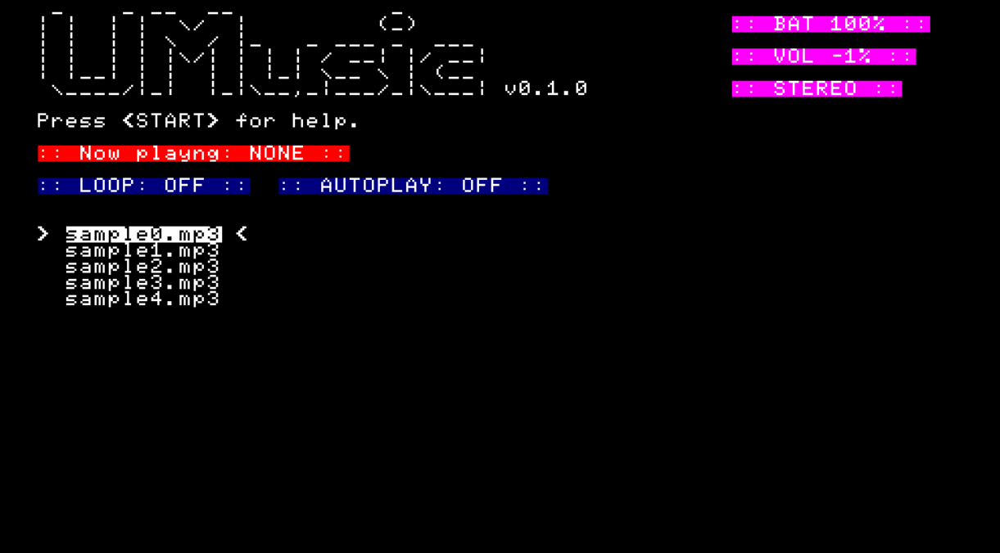

  <pre style="display: inline-block; border: 1px solid; padding: 10px;">
  _    _ __  __           _      
 | |  | |  \/  |         (_)     
 | |  | | \  / |_   _ ___ _  ___ 
 | |  | | |\/| | | | / __| |/ __|
 | |__| | |  | | |_| \__ \ | (__ 
  \____/|_|  |_|\__,_|___/_|\___|
 
A feature-rich, lightweight PSP music player.
 </pre>

# UMusic  

    
    

 

UMusic is a lightweight music player for the PSP, completely developed in Lua. It offers a variety of features, such as the ability to listen to music with the screen off, autoplay, looping, and more.

- [Installation](https://github.com/rdWei/UMusic#installation)
- [Usage](https://github.com/rdWei/UMusic#usage)

---

## Installation

- Download and extract [this](https://github.com/rdWei/UMusic/releases/download/v0.1.0/UMusic-main.zip) zip file.
- Put the "UMusic-main" folder inside `PSP/GAME/`.
- If you want to add music, place it in `UMusic-main/songs`.

## Usage

- **Pause**: CIRCLE
- **Select**: CROSS
- **Move Up**: UP
- **Move Down**: DOWN
- **Screen Off**: L
- **Screen On**: HOLD 1s R
- **Loop On**: WLAN SWITCH ->
- **Loop Off**: WLAN SWITCH <-
- **Autoplay On/Off**: SQUARE

>Feel free to improve this project!
